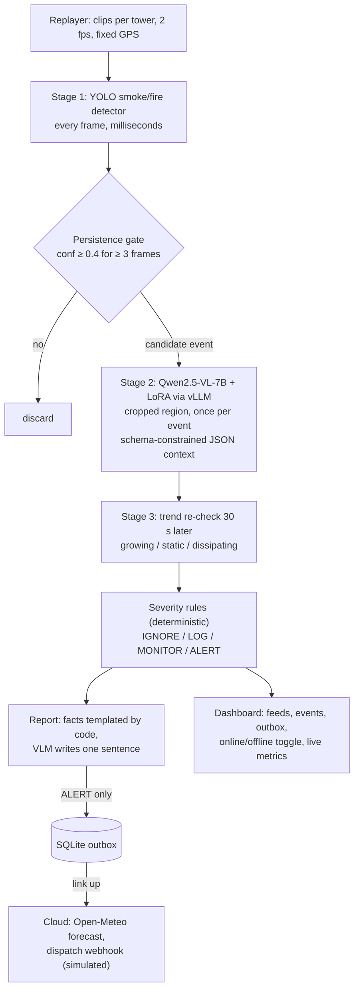

# Wildfire Edge Sentinel

> **Demo:** [docs/DEMO_RUNBOOK.md](docs/DEMO_RUNBOOK.md) · **Deep dive:** [docs/PROJECT_DEEP_DIVE.md](docs/PROJECT_DEEP_DIVE.md) · **Progress:** [docs/PROGRESS.md](docs/PROGRESS.md) · **Versions:** [docs/versions/](docs/versions/README.md) · current release `v1.3.0-joint`

Edge-first wildfire smoke detection for remote lookout towers, running on one HP ZGX Nano (NVIDIA GB10).
It detects smoke, works out what kind of fire it is (wildland, campfire, stack, fog...) and whether it is
growing, assigns a severity, and writes a dispatch-ready report locally. It contacts the cloud only for
confirmed alerts. Built for the HP Edge AI SJSU Hack.

## Problem and user

**User:** a fire lookout or ranger watching remote wildland camera towers.

**Problem:** towers sit where connectivity is weak or absent. Streaming video to a cloud model is often
impossible (no link), costly (satellite/cellular per-MB, per-token pricing at 24/7 frame rates) and slow,
yet early smoke is where minutes matter. Naive detectors also flood dispatch with false alarms from
campfires, BBQs, chimneys, industrial stacks, fog, dust and low cloud.

**Approach:** a cascade on the tower's edge box. A cheap detector runs on every frame, a local
vision-language model runs once per candidate event, and deterministic rules decide severity. Only ALERT
reports (about 1 KB plus one thumbnail) go upstream, and they wait in an outbox until the link is up.

## Architecture



One Python service (`sentinel/`) plus one local vLLM server (`zrt serve`). If the VLM times out or returns
bad JSON, the pipeline falls back to detector + trend rules with a minimum severity of MONITOR. It never
silently ignores a detection.

## The escalation rule

**The cloud is used only for data the tower cannot produce (forecast, burn schedules) and only for ALERT
events; video never leaves the device.**

| Severity | Examples | Edge action | Cloud action |
|---|---|---|---|
| IGNORE | fog, cloud, dust; known stack in its zone | count in metrics | none |
| LOG | attended campfire, BBQ/chimney, static | store locally | none |
| MONITOR | unclear source, small but new | re-check on a timer; escalate on growth | none until upgraded |
| ALERT | growing, uncontrolled, black smoke, near structures/road | queue report immediately | send report + 1 thumbnail, then fetch forecast and send it as a small update |

An ALERT is queued at once and sent first, marked "forecast pending": it is never held back for the
forecast, which follows as a small `forecast_update` when it can be fetched. While the link is down,
failed sends are retried with a backoff capped at 10 s, so the alert goes out within seconds of the
link returning. After an outage every queued ALERT is sent before any forecast is fetched. A forecast
update that cannot be delivered is queued as `<event_id>:forecast` and retried. A retried send can reach
dispatch twice, so dispatch should dedupe on `event_id` (the stub in `scripts/dispatch_stub.py` does, and
merges updates into their alert).

## Before vs after fine-tuning

Both learned stages are measured before and after fine-tuning, on the same held-out data, with the same
scripts:

| Stage | Before | After | Held-out data |
|---|---|---|---|
| Detector | YOLO-World (`yolov8s-worldv2.pt`) zero-shot, prompted with `smoke, fire` | YOLO11s fine-tuned on D-Fire | D-Fire test split |
| Context VLM | Qwen2.5-VL-7B-Instruct base | same base + LoRA distilled from a Qwen2.5-VL-32B teacher | `data/teacher/heldout.jsonl` (never trained on) |
| End-to-end | before detector + base VLM | fine-tuned detector + LoRA VLM | 20–40 labeled clips (`data/bench/clips.csv`) |

Reference rows: a SigLIP linear probe (cheap floor) and the 32B teacher itself (upper bound).

**Fairness note:** the held-out labels come from the 32B teacher, so context-VLM accuracy on them measures
distillation (agreement with the teacher), not ground truth. The optional hand-checked gold split
(`*_gold` rows) measures real accuracy.

**Results** (all measured on the Nano; full tables in [`results/before_after.md`](results/before_after.md),
generated by `python scripts/compare.py` from `results/*.json`):

| What | Before | After |
|---|---|---|
| Detector, D-Fire test mAP50 | 0.002 (YOLO-World zero-shot) | **0.787** (YOLO11s) |
| Detector, lookout-tower smoke mAP50 (pyro-sdis val, 960 px) | 0.198 (D-Fire-only model) | **0.718** (joint model, deployed; D-Fire stays 0.748) |
| Context VLM agreement with the 32B teacher (500 held-out crops) | 45.0% source type / 53.0% group | **73.6% / 75.6%** (LoRA 7B) |
| End-to-end, 25 real tower clips (15 fires, 10 no-fire) | recall 0/15 | **recall 11/15**, 6/10 no-fire clips alerted* |
| VLM calls | — | 1 per ~40 frames, ~220 tokens each |

\*Some "no-fire" clips contain unlabelled smoke (pyro-sdis does not label every frame) and one is a genuine
low-cloud confusion; the benign set is being hand-checked, so treat precision as provisional. Detector
history: tower fine-tuning alone reached 0.728 on towers but fell to 0.106 on D-Fire (catastrophic
forgetting); joint replay training fixed it. Versions and weights: [docs/versions/](docs/versions/README.md).
Each script refuses to overwrite an existing result unless given `--force`.

Why these metrics: mAP50/mAP50-95 are standard for detection; source-type and group
(danger/benign/look-alike) accuracy capture whether the VLM tells a wildfire from a campfire or fog;
parse-fail rate and tokens per call show the cost of structured output; end-to-end precision and false
alarms are what a dispatcher actually sees; frames per VLM call shows how much work the cascade avoids.

## Reproduce

Everything runs on the Nano except the unit tests (`pytest`, laptop-friendly, no GPU). Run long GPU jobs in
`tmux`. The full command list, with expected outputs, is in
[`docs/plans/2026-09-22-wildfire-edge-sentinel.md`](docs/plans/2026-09-22-wildfire-edge-sentinel.md).

```bash
# 0. Setup (CUDA PyTorch for GB10 first, per the NVIDIA DGX Spark playbook)
./scripts/setup_nano.sh && source .venv/bin/activate
zrt config set proxy.auth.type none && zrt config set proxy.tls.enabled false   # setup_nano.sh does this too
zrt serve hf:Qwen/Qwen2.5-VL-7B-Instruct --host 0.0.0.0 --port 8000 \
  --max-model-len 8192 --gpu-memory-utilization 0.30 --enable-prefix-caching   # tmux: vlm
# put the id from `curl -s localhost:8000/v1/models` into config/settings.json as vlm_model

# 1. Data (some steps are manual; the script prints them)
./scripts/download_data.sh

# 2. Detector: before -> train -> after
python scripts/eval_detector.py --weights yolov8s-worldv2.pt --classes smoke,fire --name before_yoloworld
python scripts/train_detector.py --epochs 40            # -> models/smoke_yolo.pt
python scripts/eval_detector.py --weights models/smoke_yolo.pt --name after_yolo11s

# 3. Context VLM: teacher labels -> before -> LoRA -> after
zrt serve hf:Qwen/Qwen2.5-VL-32B-Instruct-AWQ --host 0.0.0.0 --port 8001 \
  --max-model-len 8192 --gpu-memory-utilization 0.40                          # tmux: teacher
python scripts/teacher_label.py --model "<teacher id>" --n 2000   # -> data/teacher/{train,heldout}.jsonl
python scripts/eval_context.py --model "<base id>" --name before_base7b
python scripts/eval_context.py --model "<teacher id>" --base-url http://localhost:8001/v1 --name ref_teacher32b
python scripts/train_lora.py                            # stop the teacher first; -> adapters/context
# stop the base-7B `vlm` server (it holds :8000), then re-serve it with the adapter:
zrt serve hf:Qwen/Qwen2.5-VL-7B-Instruct --host 0.0.0.0 --port 8000 --max-model-len 8192 \
  --gpu-memory-utilization 0.30 --enable-prefix-caching \
  --enable-lora --max-lora-rank 16 --lora-modules context=$HOME/sentinel/adapters/context
python scripts/eval_context.py --model context --name after_lora7b
python scripts/linear_probe.py
# optional hand-checked gold split (same JSONL format): real accuracy, not teacher agreement
python scripts/eval_context.py --model "<base id>" --split data/gold/gold.jsonl --name before_base7b_gold
python scripts/eval_context.py --model context --split data/gold/gold.jsonl --name after_lora7b_gold

# 4. End-to-end: before -> after (stop sentinel.main first to free the GPU)
python scripts/bench.py --name before --detector-weights yolov8s-worldv2.pt --detector-classes smoke,fire --model "<base id>" --recheck-s 5
python scripts/bench.py --name after  --detector-weights models/smoke_yolo.pt --model context --recheck-s 5

# 5. Tables and cost model
python scripts/bench.py --name base_full --model "<base id>" --full-frame --recheck-s 5   # full-frame ablation for the cost model
python scripts/compare.py                               # -> results/before_after.md
python scripts/cost_model.py > results/cost_model.jsonl # fill config/cost_inputs.json from bench results first

# 6. Demo: dispatch stub + sentinel + dashboard on :8080
#  - point each `source` in config/towers.json at a real data/demo/<sequence> folder
#    (a FIgLib wildfire sequence for t1, a benign clip/folder for t2; plan Task 23 Step 4)
#  - set "vlm_model" in config/settings.json to the exact served id: "context" once the LoRA
#    adapter is served, otherwise the base id from `curl -s localhost:8000/v1/models`
#  - start from an empty outbox before recording
rm -f data/outbox.db
./scripts/run_all.sh
```

The runtime VLM timeout (`vlm_timeout_s`, default 15 s) bounds how long one context call can stall the
replay loop. Set it in `config/settings.json` to about 2× the `latency_ms_p95` measured by
`eval_context.py` (in seconds).

`--recheck-s 5` shortens the trend re-check (default 30 s) so growth can escalate within a clip; use the
same value for both runs. The BEFORE bench uses the same 0.4 confidence gate as AFTER, so zero-shot
YOLO-World recall may be low by design; its detector mAP from `eval_detector.py` is gate-independent.
Optional ablations: `bench.py --detector-only` (no VLM) and `--full-frame` (no crop: token cost of
cropping). To run the live demo with the BEFORE detector, set `"detector_weights": "yolov8s-worldv2.pt",
"detector_classes": ["smoke", "fire"]` in `config/settings.json`.

## Sentinel Console (one system, port 8080)

The home page is the **forest-officer console** (incident map, Live watch, Ask Sentinel, Report sighting, Simulate outage) with tabs for **Edge vs Cloud**, **Mobile camera**, **Models** and **System** ([v2.1.0](docs/versions/v2.1.0-officer-console.md)); a compact console is at `/console/`. Everything in one place: incidents on a map, tower and mobile cameras, alert delivery, **Edge vs Cloud**, models and system health. It is one server with one detector load, one uplink and one alert outbox, and it needs **no internet**: the models, map and UI run on the Nano, and ALERTs queue until the link returns.

```bash
cd ~/sentinel && ./scripts/start_console.sh        # --lan also serves the local network
# laptop: ssh -N -L 8080:localhost:8080 hp11@<nano-ip>   → http://localhost:8080
```

| Page | What it shows |
|---|---|
| Operations | Map, active incidents, incident drawer (frames, timeline, location, dispatch report), field reports |
| Cameras | Tower feeds, **Run drill** (a recorded fire replayed through the towers), the mobile unit (webcam / iPhone) |
| Alerts | Every ALERT that left or is waiting to leave the device; test push |
| Edge vs Cloud | The same frames through both designs: data, VLM calls, tokens, time to decision per link profile, frames decided offline, fleet projection |
| Models | Deployed detector and VLM with their scores; switch LoRA adapter; compare on an image |
| System | Health, GPU and memory, uplink with **Test outage** |

On a 91-frame recorded fire the edge made 8 VLM calls and sent 0 B, where cloud-only would have made 90 calls on 151K tokens and uploaded 6.7 MB, for about the same time to decision on LTE (5.5 s vs 5.7 s). Details: [docs/versions/v2.0.0-console.md](docs/versions/v2.0.0-console.md). The per-port apps below remain for the v1.x releases.

### Run with Docker

The console also ships as a container (`Dockerfile`, `docker-compose.yml`). On the HP ZGX Nano (arm64, NVIDIA GB10), the image uses the same CUDA 13 PyTorch as the native install. The VLM stays in HP zrt on the host, and the container reaches it through the zrt socket. Weights, map tiles, recordings and state are mounted; the image holds only code and dependencies, and nothing needs the internet at run time.

```bash
cd ~/sentinel                                    # VLM already served by zrt (start_console.sh step 1)
sudo docker compose up -d --build                # or add your user to the docker group once
sudo docker compose logs -f console              # health: curl localhost:8080/api/overview
```

| Mounted | From (Nano default) | Why |
|---|---|---|
| `/app/models` | `~/sentinel/models` | detector weights (joint + D-Fire) |
| `/app/weights`, `/opt/sentinel/yolov8s-worldv2.pt` | `~/sentinel/weights`, `~/sentinel/yolov8s-worldv2.pt` | the before-fine-tuning detector and its CLIP encoder, offline |
| `/app/data`, `/assets` | `~/sentinel/data`, `~/sentinel-assets` | sample photos, recordings, offline map |
| `/app/results` | `~/sentinel/results` | evaluation results for the Models page |
| `/state` | `~/sentinel-state/console` | incidents, frames, alert outbox |
| `/opt/hp/zrt/run` | same | VLM socket and live model metrics |

Phone alerts come from `~/.sentinel_alerts.env` (`NTFY_TOPIC_URL`), passed to the container as an env file and never baked into the image. Override any path in a `.env` file next to `docker-compose.yml`. The port is published on `127.0.0.1` only (use the SSH tunnel); change it to `8080:8080` to serve a tower LAN. Stop the native console first (`tmux kill-session -t console`), because both use port 8080. For a laptop without an NVIDIA GPU, build with `--build-arg TORCH_INDEX=https://download.pytorch.org/whl/cpu`.

## Live metrics dashboard

`sentinel.monitor` is a second, read-only page that shows tokens, latency and edge-vs-cloud economics
for every model zrt is serving, while those models run. It finds the backends from
`/opt/hp/zrt/run/vllm-<label>.json` and reads each one's vLLM Prometheus `/metrics` over its unix
socket (`vllm-<label>.sock`). One background thread polls all sockets in parallel every 2 s (1 s
timeout each), so a hung backend never blocks the page. Nothing is kept on disk.

```bash
# on the Nano (binds 127.0.0.1:8090); --pipeline-url is optional and needs the demo app on :8080
python -m sentinel.monitor --pipeline-url http://localhost:8080/api/state
# on your laptop, then open http://localhost:8090
ssh -L 8090:localhost:8090 hp11@<nano-ip>
```

Other flags: `--run-dir` (default `/opt/hp/zrt/run`), `--prices` (default `config/cost_inputs.json`),
`--host` and `--port`.

| Panel | What it shows |
|---|---|
| Header | Last poll time, GPU utilisation (`nvidia-smi`), unified memory used/total (`/proc/meminfo`). Shows "—" where unavailable, e.g. on a laptop. |
| Tokens processed at the edge | Sum of vLLM prompt + generation token counters across the served models. None of these tokens left the device. |
| Equivalent cloud API cost | The same input/output tokens priced at the $/M-token assumptions below. |
| Cloud-per-frame vs edge cascade | Needs `--pipeline-url`. Cost of sending every frame the pipeline saw to a cloud VLM (frames × tokens per full frame), next to the cascade's cost (uplink bytes only). |
| Model calls avoided by the cascade | Frames seen minus VLM calls, and frames per VLM call. |
| Bytes sent vs streaming video | Bytes the cascade actually sent upstream (alerts) vs frames × bytes per frame. |
| Served models table | Per backend: status, running requests, request/token totals (they keep counting across server restarts), tok/s in and out, KV-cache use, zrt GPU memory fraction. Also e2e latency p50/p95 and TTFT p50, computed from vLLM histogram deltas over the latest ~2 s poll window and held while the model is idle. |
| Throughput | Input and output tok/s per model over the last 5 minutes, kept in the browser. |

**Prices are user-supplied assumptions.** The page does not invent dollar figures. It starts from
`config/cost_inputs.json` (all zeros, so the page shows "set prices to see $"). Enter current published
rates in the price form: $/M input tokens, $/M output tokens, $/GB uplink, tokens per full frame and
bytes per streamed frame. They apply to this session only (`POST /api/prices`) and are not written to
disk. Token counts, latencies and frame counts are measured.

## Demo app (try the models + live economics)

`sentinel.webapp` is a two-pane page for judges. **Left:** pick a sample image (D-Fire test, a FIgLib tower
fire sequence, benign look-alikes) or upload your own, optionally set the ground truth, choose the passes,
and run them side by side. Each pass is the real cascade: detector → 0.4 gate → context VLM on a ≤448 px
crop → severity rules → dispatch report → escalation. **Right:** live usage and economics for the session:
images, VLM calls, calls the cascade avoided, tokens used vs a full-frame cloud estimate, latency,
accuracy vs ground truth, and edge vs "cloud: every image to a VLM" cost, tokens and bytes. It also shows
the online/offline counts, live vLLM metrics per served model (the same zrt sockets `sentinel.monitor`
reads) and the before/after benchmark numbers from `results/*.json`.

```bash
# on the Nano (binds 127.0.0.1:8095)
python -m sentinel.webapp
# on your laptop, then open http://localhost:8095
ssh -N -L 8095:localhost:8095 hp11@<nano-ip>
```

| Pass | Detector | Context VLM (served name on `:8000/v1`) |
|---|---|---|
| BEFORE fine-tuning | `yolov8s-worldv2.pt` zero-shot, prompted `smoke, fire` | `base7b` (Qwen2.5-VL-7B base) |
| AFTER fine-tuning | `models/smoke_yolo.pt` (YOLO11s fine-tuned) | `context` (same base + LoRA) |
| Teacher reference (optional) | `models/smoke_yolo.pt` | `teacher32b`, if served |

To run BEFORE and AFTER in one server, serve `base7b` with the adapter:
`--enable-lora --max-lora-rank 16 --lora-modules context=$HOME/sentinel/adapters/context`. The page lists
what `GET /v1/models` reports. A pass whose VLM is not served runs detector-only and says so on its card.
Other served names or weights: `--before-vlm`, `--after-vlm`, `--teacher-vlm`, `--before-weights`,
`--after-weights`. Other flags: `--vlm-base-url`, `--run-dir`, `--prices`, `--samples DIR` (repeatable;
default `data/dfire/test/images`, `data/demo`, `data/benign`), `--results`, `--towers` (the first tower
labels the reports), `--no-monitor`.

- **Network toggle:** online, an ALERT is sent with a forecast and its bytes are counted. Offline, it is
  queued in the outbox and nothing is sent. LOG and MONITOR stay on the device. Dispatch is simulated.
- **Cloud baseline:** every image uploaded (its file size) and sent whole to a Qwen2.5-VL-class model at
  ≤1280 px on its longest side, the same frame the edge VLM gets under "force VLM". Image tokens use
  Qwen's resize rule, so a 1920×1080 frame (sent as 1280×720) is 1,196 image tokens and a 448×448 crop is
  256. Each pass card also shows the native-resolution figure (2,691 for 1920×1080 at vLLM's default
  `max_pixels`). Prompt-text and output tokens per call are the ones measured on the Nano. This figure
  is an estimate and the page labels it as one.
- **Edge cost:** $0 marginal API cost (Nano hardware and power not included); the edge pays uplink only,
  counting alerts sent and alerts queued in the outbox to send later. Passes whose VLM is not served run
  detector-only and are left out of the savings comparison, on both sides.
- **Prices** are user-supplied, the same as on the monitor: `config/cost_inputs.json` starts at zero, so
  the page shows "set prices to see $" until you enter rates. Tokens, bytes and latency are measured.
- Uploads must be JPEG, PNG, WebP or BMP, 15 MB at most. GPU calls are serialized. At startup each
  available detector runs once on a blank frame in the background, so the first click does not pay the
  cold CUDA/CLIP load.

### Live camera + phone alerts

The **Live camera** tab streams a camera (webcam, or an iPhone through macOS Continuity Camera) to the
Nano: one JPEG frame every 1–2 s (≤1280 px, never more than one in flight; frames arriving while one is
processed get `202 {"busy": true}` and are skipped). Each frame goes through the real `Pipeline` as tower
`live-camera`: the AFTER detector at its own size, the persistence gate (3 frames ≥ 0.4), one call to the
LoRA `context` VLM per event, a trend re-check every `--live-recheck-s` (default 10 s, for demo pacing) and
the per-tower latch, so a fire raises **one** ALERT. The page draws the boxes over the preview and shows
gate progress, the event, severity and the VLM verdict.

ALERTs are delivered for real: a push to your phone through [ntfy](https://ntfy.sh) (title, dispatch
text, urgent priority, snapshot attached) and, with `--dispatch-url`, a POST to dispatch. Delivery goes
through a durable outbox (`--state-dir`, default `data/live_outbox.db`): offline, the alert waits; toggling
**Online** sends it at once; failed pushes are retried every few seconds. Real ALERTs are never dropped
by a rate limit: a burst guard (more than 5 pushes a minute) only holds extra alerts in the outbox for a
few seconds. An alert still queued 10 minutes after detection (e.g. across a restart) is marked expired and
not pushed. Without `--dispatch-url` no forecast is fetched. ALERTs from the single-image tab (samples,
uploads) are pushed only with `--deliver-image-alerts` (one per photo). **Send test alert** checks the
phone before the demo; test pushes are limited to one per 30 s.

```bash
# once, on the Nano: the topic URL is a secret (anyone who knows it can read the alerts)
echo 'export NTFY_TOPIC_URL=https://ntfy.sh/<long-random-topic>' > ~/.sentinel_alerts.env
chmod 600 ~/.sentinel_alerts.env        # optional: export NTFY_TOKEN=tk_... for a protected server
./scripts/start_demo.sh                 # loads it (set -a); prints only "phone alerts: configured"
```

The camera needs a secure origin: open the page as `http://localhost:8095` through the SSH tunnel, not
`http://<nano-ip>:8095`. Endpoints: `POST /api/live/frame` (body = JPEG, `?stream=<id>`),
`POST /api/live/reset`, `POST /api/notify/test`. The topic URL is read from the environment only; logs
show the host and at most the first 4 characters of a long topic, and the page and API show the host only.
Stream from one browser tab at a time: all tabs feed the same live pipeline.

## Incident map (offline, port 8100)

`sentinel.incident_map` is an operations view of the tower network: every confirmed detection becomes an
incident on an offline map of California, with a severity, county, location, the camera's bearing to the
smoke, the wind from the tower's own weather station and an indicative downwind cone. Map tiles, fonts,
wind and models all come from the box itself; with the uplink cut, everything on the page still works.

```bash
./scripts/setup_map_assets.sh        # once, while online: ~1.5 GB into ~/sentinel-assets (outside git)
./scripts/fetch_figlib.sh            # 20 FIgLib recordings (12 fires, ~740 MB), rate-limited, into ~/sentinel-assets/figlib
python scripts/build_cameras.py      # config/cameras.json from HPWREN's camera list + the recordings on disk
python -m sentinel.incident_map      # binds 127.0.0.1:8100; uplink starts OFFLINE
ssh -N -L 8100:localhost:8100 hp11@<nano-ip>   # laptop, then http://localhost:8100
```

- **Cameras** (`config/cameras.json`, built by `scripts/build_cameras.py`) are the 19 real HPWREN cameras
  that recorded our 20 FIgLib sequences, with their published coordinates, heading and 90° field of view
  (`hpwren.ucsd.edu/cameras/sites.js`) and their weather station where the site has one. The recordings
  cover 12 fires from June–September 2026; the Junction Fire was recorded by six towers and the Creelman
  Fire by three. FIgLib data: HPWREN, https://www.hpwren.ucsd.edu/ (credit required).
- **Triangulation:** one tower measures only the direction to the smoke. When a second tower's bearing
  line crosses an active incident's line (in front of both cameras, within 60 km, within 30 min), its
  sighting joins that incident and the pin moves to the least-squares crossing point of all the towers'
  lines (`geo.triangulate`); the note says how closely the lines agree. On the Junction Fire recording,
  with the stage-2 tower detector 4 of the 6 towers detected the smoke and their lines agree within
  0.3 km (266 frames, 14 VLM calls). With the deployed joint detector (960 px) the demo watch forms one
  ALERT incident triangulated from 2 towers (Big Black, Mesa Grande; 65 frames). With exactly two towers
  the lines always meet at one point, so agreement is only informative with three or more.
- **Consolidation:** a tower can open an incident on haze before the real plume appears, so a second
  tower's sighting may start a separate one. Whenever an incident's position changes, any other active
  incident that is the same fire (fixes within 5 km, or one tower's line passing within 5 km of the other's
  fix, or two single-tower lines crossing) is merged into it: towers, frames, timeline and alert. With it,
  the Junction Fire replay is one incident from 4 towers and the Creelman Fire one from 3.
- **Frames and the large view:** every frame of an incident from the moment it opens is kept in
  `state/frames/<incident>/` (labelled boxes, ≤1280 px) with its detections, detector time and, for the
  frames the VLM checked, its verdict, tokens in/out, crop size and escalation. The incident panel plays
  them back (filterable by tower); clicking a frame opens a large centred view that scrolls down to the
  full analysis: detector, VLM verdict, impact, dispatch report, escalation, cost of the pass, edge vs
  cloud-only for that frame.
- **Inputs:** tower frames (FIgLib replays), 36 close-up flame photos from the D-Fire test split as demo
  field reports (they carry no GPS: type coordinates or pick on the map), or an upload. Tower frames go
  through the tower detector (`--detector-weights`, default `joint_yolo.pt` at 960 px: trained jointly on
  D-Fire and tower frames, tower mAP50 0.718 without forgetting D-Fire, 0.748); photos and uploads through
  the D-Fire detector (`--photo-detector-weights`, default `smoke_yolo.pt` at 640 px, D-Fire mAP50 0.787 vs
  0.106 for the stage-2 tower model). `--detector-imgsz` / `--photo-detector-imgsz` override the sizes. A
  retrained model written to the same path is reloaded on its next use.
- **Demo scenarios** (`config/demo_scenarios.json`, "Demo guide" tab → *Load demo scenarios*): mock inputs,
  real analysis. Eleven photos from the D-Fire dataset, each given a made-up San Diego County location, go
  through the same detector, fine-tuned VLM and rules; two FIgLib recordings start as live watches; the last
  steps restore the link and ask the assistant. Each step shows the expected path and the actual result.
  The photos were picked by running candidates through the pipeline and checking each image by eye; on the
  last load all eleven matched: 4 ALERT (flames in trees, plume behind a town, grass fire, vehicle fire),
  2 MONITOR (grass burning by buildings, industrial smoke), 3 LOG (attended field burn, farm column, hazy
  look-alike), 2 IGNORE at the detector (red storm cloud, hill mist). The loader starts with the link down.
  There is no true campfire example in our data (the teacher labelled 3 of 3,100 crops as campfire, and
  none behaved as one), so the benign example is an attended controlled burn.
- **No internet at run time.** In the field the camera and weather station sit on the tower's local
  network next to this box; here recorded FIgLib frames and a stored weather reading stand in for them.
  Map, models, wind, history and the assistant are all local. Only an ALERT uses the uplink (the report
  and a forecast). Internet is needed once, at setup, to download the map, recordings and models.
- **Location**, in priority order: GPS tags in the image (none of our datasets carry any) → coordinates
  sent with the image (a field report or emulated GPS) → the camera bearing (the smoke's column in the
  frame through a pinhole model, placed at an assumed `--range-km`, default 10 km) → the camera site. The
  bearing is measured; the distance is not, and the page says so. The operator can move the pin, and the
  county is recomputed offline from Census boundaries.
- **Wind** needs no internet. HPWREN towers carry a Vaisala WXT536 station; with no serial link to one here,
  an emulator replays one real reading per station (captured into `state/wx_seed.json`) with a small
  random walk, and every reading is labelled "emulated". Fallbacks: a value typed by the operator, then the
  forecast cached from the last ALERT escalation (the cloud is contacted only then), then nothing.
- **Downwind cone:** 10% of the wind speed × the horizon (1/3/6 h), ± half the observed direction range.
  This is the grass-fuel rule of thumb (Cruz & Alexander 2019), shown as "where to look first", not as a
  fire-spread model.
- **Escalation** is the same rule as everywhere else: IGNORE is counted only, LOG/MONITOR stay on the box,
  and an ALERT is sent once per incident (or waits in the outbox until the link is toggled back up).
  Repeat frames from the same camera within 12° and 2 h update one incident, never re-send it.
- **Live watch** (continuous monitoring): replays a fire's FIgLib frames from every tower that recorded
  it, merged in time order, as if live. Every frame goes
  through the detector; an incident opens after `--gate-frames` (default 2) frames in a row with smoke, with
  one VLM call. After that, each batch of N frames produces a situation update in the incident timeline:
  frames with smoke, plume-area change, trend (growing / steady / shrinking) and one VLM re-check. Growth
  can raise the severity and trigger the one-time escalation. On the Beaver Fire recording: 46 frames,
  8 VLM calls, opened as MONITOR and raised to ALERT at the first batch (plume area ×4.8) with the stage-2
  tower detector; with the deployed joint detector the demo watch also ends at ALERT (37 frames, 8 updates). "Load fire
  history" replays all 20 recordings (12 fires) with their real timestamps and archives them as history.
- **Ask Sentinel** (`sentinel/assistant.py`): the on-device Qwen2.5-VL-7B (`--assistant-model`, default
  `base7b`) plans up to three tool calls with schema-constrained JSON (attention now, summarize a period,
  list incidents, incident detail, wind outlook, draft dispatch). Code runs them against the local incident
  store, and the model answers from those facts only; "explain" questions also get the incident's frame.
  Each answer lists its tool calls, tokens and latency. Nothing leaves the device.
- Defaults: detector `~/sentinel/models/joint_yolo.pt`, VLM `context` on the zrt backend socket. State
  (`incidents.db`, forecast cache) lives in `~/sentinel-assets/state`; `--state-dir` moves it, so a second
  instance never shares a DB with the first. `--no-sensor` turns off the emulator; `--start-online` starts
  with the link up.

## Datasets and models

Licenses below are as published by each source at the time of writing. **Verify each one before
redistributing data or weights.**

| Item | Use | License (verify) |
|---|---|---|
| [D-Fire](https://github.com/gaiasd/DFireDataset) | detector train/test (0=smoke, 1=fire) | see repository |
| [PyroNear `pyro-sdis`](https://huggingface.co/datasets/pyronear/pyro-sdis) | optional detector data/eval | see dataset card |
| [FIgLib (HPWREN)](https://www.hpwren.ucsd.edu/FIgLib/) | demo and benchmark sequences | HPWREN terms of use |
| Benign look-alikes | campfire/BBQ/stack/fog negatives | per-image open licenses |
| [Ultralytics](https://github.com/ultralytics/ultralytics) YOLO11s, YOLO-World | detector | AGPL-3.0 |
| [Qwen2.5-VL-7B-Instruct](https://huggingface.co/Qwen/Qwen2.5-VL-7B-Instruct) | student VLM | see model card |
| Qwen2.5-VL-32B-Instruct-AWQ | teacher (offline labeling only) | see model card |
| [SigLIP](https://huggingface.co/google/siglip-base-patch16-224) | linear-probe baseline | see model card |

Ultralytics is AGPL-3.0: a networked deployment of this service must offer its source, or use an
Ultralytics enterprise license.

## Edge vs cloud-only (measured)

The same model, Qwen2.5-VL-7B-Instruct (base weights: a hosted provider cannot run our LoRA), behind any
OpenAI-compatible provider, with **every frame sent to the cloud**. It is scored on the same 500 held-out
crops (same crop prompt as the edge) and the same tower clips (whole frames, with a full-frame prompt that
lets the model answer "no smoke"). Configuration comes only from environment variables; never put the key
in a file, a command line you save, or a commit:

- `CLOUD_VLM_BASE_URL`: the provider's OpenAI-compatible `/v1` URL
- `CLOUD_VLM_MODEL`: the provider's id for Qwen2.5-VL-7B-Instruct
- `CLOUD_VLM_API_KEY`: the API key
- `CLOUD_VLM_RESPONSE_FORMAT` (optional): `json_schema` (default), `json_object` or `none`. Use `json_object` or `none` if the provider rejects `json_schema`; the schema then goes into the system prompt.

```bash
# run from the machine that holds data/ (the Nano); cloud latency is measured from there
# A. context accuracy + real cloud latency on the same 500 crops (dry run first)
python scripts/eval_context.py --cloud --limit 20 --name dryrun            # 20 calls
python scripts/eval_context.py --cloud                       # -> results/context_cloud_qwen7b.json
# B. cloud-only end-to-end on the tower clips, per link profile (dry run first)
python scripts/bench_cloud.py --limit 2 --frame-stride 10 --name dryrun     # ~8 calls
rm results/context_dryrun.json results/bench_cloud_dryrun.json            # dry runs are not results
python scripts/bench_cloud.py                                 # -> results/bench_cloud_cloud_qwen7b.json
# C. edge side: step 4's bench.py runs record first_alert_s and alert_payload_bytes per clip; also
#    time the deployed trend re-check (recheck_s = 30 s) next to the --recheck-s 5 runs
python scripts/bench.py --name after_recheck30 --detector-weights models/smoke_yolo.pt --model context --recheck-s 30
# D. outage: link down for the first 10 min of every clip, edge vs cloud
python scripts/outage_scenario.py --edge after --cloud cloud_qwen7b --outage-min 10
python scripts/outage_scenario.py --edge after --cloud cloud_qwen7b --outage-min 10 --outage-lead-min 5  # link was already down 5 min before the fire
python scripts/compare.py                                     # adds the "Edge vs cloud-only" section
```

**What the comparison shows, honestly.** The edge analyses every frame during an outage, so it can act
locally at once. When the link returns it sends a few KB (the alert with its thumbnail), not megabytes of
backlog. It also does not need the fire to still be visible then. It wins clearly on slow links (rural
cellular, GEO satellite), where full frames queue on the uplink. After a clean outage on a good link, the
difference in when dispatch knows is seconds, not minutes: a cloud-only camera that resumes streaming sees
the fire again quickly, as long as it is still visible.

**Fairness rules built into the scripts.**
- **Decision rules:** the cloud gets a per-frame rule and a temporal rule. The temporal rule uses K
  consecutive positive frames plus a size trend over the same re-check window, matching the edge's gate
  and re-check.
- **Cadence:** a cheaper cadence (one frame per 10 s) is derived from the same answers at no extra cost.
- **Uplink model:** the uplink is busy only while a frame serializes. Round trips are added to the
  decision time: 1 per cloud request on a kept-alive connection, and 3 for the edge's one-shot alert POST
  on a new HTTPS connection.
- **Upload policy:** the live policy sends the newest frame whenever the uplink frees (`--policy latest`).
- **No double counting:** each run measures a network baseline (the fastest of 5 `GET /models`
  requests) and subtracts it from the measured cloud latency before a link profile is added. Without
  this, the eval machine's own network time would be a constant overstatement on every link. The
  baseline is approximate: it is a different request from an inference call, and the image upload
  from the eval machine is not in it. A large `/models` body inflates it, and the script warns about
  that.
- **Edge delivery:** follows the shipped code. The outbox retries after 2, 4, 8 s and then every 10 s,
  flushes every 2 s, and sends the alert before the forecast.
- **Paired statistics:** the tables report the p50 over clips where both sides alerted, plus per-clip
  deltas. The base-7B edge run (`bench_before`) sits next to the LoRA run, so base vs base is visible.
- **Errors, retries and caching:** transient provider errors (429, timeouts, 5xx) are retried up to 3
  times, and the backoff is not counted as latency. A reply that cannot be parsed is not re-requested,
  since at temperature 0 that would bill twice for the same answer. The cache key covers host, model,
  response format, prompts, `max_tokens` and image bytes.

**Measured:**
- cloud answers and accuracy, with accuracy also reported over answered calls only;
- provider-reported tokens (billed);
- the real cloud round trip from the machine that ran the script. This is taken over fresh calls only;
  answers served from the cache are counted separately, with the latency measured when they were first
  fetched;
- the network baseline;
- edge decisions, compute time and alert sizes, from the on-device runs.

**Modelled:** the tower's uplink. `sentinel/netprofile.py` defines fixed link profiles (`fiber`, `lte`,
`rural_cellular`, `satellite_geo`, `outage`) and outage windows, layered on top of the measured
latency. The profiles use round, typical rates. The loss model (rate / (1 − loss)) is optimistic, most of
all for GEO satellite. Frames that the camera would capture outside the ~20 s recorded clips are
modelled: for the cloud after a long outage, the clip's last answered frames are held; for the buffered
backlog, median-size frames are used. We do not throttle the Nano's real network, because that would cut
the SSH/Tailscale link.

**Cost warning:** every uncached frame is a paid API call. The full crop eval is 500 calls, and the clip
bench is about 1,000 frames at stride 1. Start with `--limit` and `--frame-stride`, and cap a run with
`--max-fresh-calls N`. Answers are cached in `data/cloud_cache.jsonl` (git-ignored), so re-running (with
other profiles, policies, outages or `--force`) does not bill again. Dollar figures stay "unpriced" until
you fill `usd_per_mtok_in`, `usd_per_mtok_out` and `usd_per_gb` in `config/cost_inputs.json` with your
provider's published rates.

## Limitations

- **Simulated world:** towers are replayed clips, the temperature sensor and the connectivity toggle are
  simulated, and the dispatch webhook is a local stub. The burn schedule is a local file.
- **Teacher labels are not ground truth:** the LoRA student learns to agree with the 32B teacher. Only
  the gold split measures real accuracy, and it is small.
- **Held-out crops are hash-split from D-Fire train crops:** near-duplicate frames from the same scene
  can land on both sides and inflate distillation accuracy. The gold split addresses this.
- **Small end-to-end set:** 20–40 clips give coarse precision/recall, so treat differences of one or two
  clips as noise.
- **Bench time-to-decision** is in simulated clip seconds (frames/fps) and excludes VLM latency; events
  still MONITOR at clip end count as not alerted.
- **Single-threaded loop:** one replay thread serves every tower, and a VLM call stalls frame processing
  for all towers until it returns (bounded by the VLM timeout).

## Layout

`sentinel/` runtime (pipeline, severity, escalation, outbox, dashboard, live metrics monitor, demo web app) · `scripts/` training,
evaluation, benchmark and setup · `config/` settings, towers, cost inputs · `tests/` unit tests
(`pytest`) · `docs/plans/` design and implementation plan.
