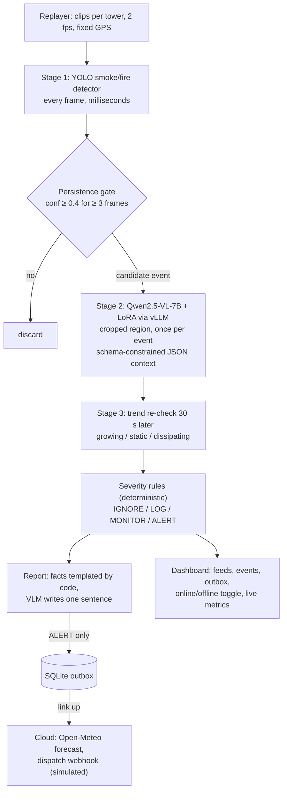

# Wildfire Edge Sentinel

Edge-first wildfire smoke detection for remote lookout towers, running on one HP ZGX Nano (NVIDIA GB10).
It detects smoke, works out what kind of fire it is (wildland, campfire, stack, fog...) and whether it is
growing, assigns a severity, and writes a dispatch-ready report locally. It contacts the cloud only for
confirmed alerts. Built for the HP Edge AI SJSU Hack.

## Problem and user

**User:** a fire lookout or ranger watching remote wildland camera towers.

**Problem:** towers sit where connectivity is weak or absent. Streaming video to a cloud model is often
impossible (no link), costly (satellite/cellular per-MB, per-token pricing at 24/7 frame rates) and slow,
yet early smoke is where minutes matter. Naive detectors also flood dispatch with false alarms from
campfires, BBQs, chimneys, industrial stacks, fog, dust and low cloud.

**Approach:** a cascade on the tower's edge box. A cheap detector runs on every frame, a local
vision-language model runs once per candidate event, and deterministic rules decide severity. Only ALERT
reports (about 1 KB plus one thumbnail) go upstream, and they wait in an outbox until the link is up.

## Architecture



One Python service (`sentinel/`) plus one local vLLM server (`zrt serve`). If the VLM times out or returns
bad JSON, the pipeline falls back to detector + trend rules with a minimum severity of MONITOR. It never
silently ignores a detection.

## The escalation rule

**The cloud is used only for data the tower cannot produce (forecast, burn schedules) and only for ALERT
events; video never leaves the device.**

| Severity | Examples | Edge action | Cloud action |
|---|---|---|---|
| IGNORE | fog, cloud, dust; known stack in its zone | count in metrics | none |
| LOG | attended campfire, BBQ/chimney, static | store locally | none |
| MONITOR | unclear source, small but new | re-check on a timer; escalate on growth | none until upgraded |
| ALERT | growing, uncontrolled, black smoke, near structures/road | queue report immediately | fetch forecast, send report + 1 thumbnail |

An ALERT raised while offline is queued at once and sent the moment the link returns, marked
"forecast pending" if the forecast cannot be fetched yet.

## Before vs after fine-tuning

Both learned stages are measured before and after fine-tuning, on the same held-out data, with the same
scripts:

| Stage | Before | After | Held-out data |
|---|---|---|---|
| Detector | YOLO-World (`yolov8s-worldv2.pt`) zero-shot, prompted with `smoke, fire` | YOLO11s fine-tuned on D-Fire | D-Fire test split |
| Context VLM | Qwen2.5-VL-7B-Instruct base | same base + LoRA distilled from a Qwen2.5-VL-32B teacher | `data/teacher/heldout.jsonl` (never trained on) |
| End-to-end | before detector + base VLM | fine-tuned detector + LoRA VLM | 20–40 labeled clips (`data/bench/clips.csv`) |

Reference rows: a SigLIP linear probe (cheap floor) and the 32B teacher itself (upper bound).

**Fairness note:** the held-out labels come from the 32B teacher, so context-VLM accuracy on them measures
distillation (agreement with the teacher), not ground truth. The optional hand-checked gold split
(`*_gold` rows) measures real accuracy.

**Results:** [`results/before_after.md`](results/before_after.md) is generated by
`python scripts/compare.py`, which builds all three tables from the `results/*.json` files. Results are pending
until the Nano runs finish, and no numbers appear here that the scripts did not produce. Each script
refuses to overwrite an existing result unless given `--force`, so a BEFORE row cannot be silently
replaced.

Why these metrics: mAP50/mAP50-95 are standard for detection; source-type and group
(danger/benign/look-alike) accuracy capture whether the VLM tells a wildfire from a campfire or fog;
parse-fail rate and tokens per call show the cost of structured output; end-to-end precision and false
alarms are what a dispatcher actually sees; frames per VLM call shows how much work the cascade avoids.

## Reproduce

Everything runs on the Nano except the unit tests (`pytest`, laptop-friendly, no GPU). Run long GPU jobs in
`tmux`. The full command list, with expected outputs, is in
[`docs/plans/2026-09-22-wildfire-edge-sentinel.md`](docs/plans/2026-09-22-wildfire-edge-sentinel.md).

```bash
# 0. Setup (CUDA PyTorch for GB10 first, per the NVIDIA DGX Spark playbook)
./scripts/setup_nano.sh && source .venv/bin/activate
zrt config set proxy.auth.type none && zrt config set proxy.tls.enabled false   # setup_nano.sh does this too
zrt serve hf:Qwen/Qwen2.5-VL-7B-Instruct --host 0.0.0.0 --port 8000 \
  --max-model-len 8192 --gpu-memory-utilization 0.30 --enable-prefix-caching   # tmux: vlm
# put the id from `curl -s localhost:8000/v1/models` into config/settings.json as vlm_model

# 1. Data (some steps are manual; the script prints them)
./scripts/download_data.sh

# 2. Detector: before -> train -> after
python scripts/eval_detector.py --weights yolov8s-worldv2.pt --classes smoke,fire --name before_yoloworld
python scripts/train_detector.py --epochs 40            # -> models/smoke_yolo.pt
python scripts/eval_detector.py --weights models/smoke_yolo.pt --name after_yolo11s

# 3. Context VLM: teacher labels -> before -> LoRA -> after
zrt serve hf:Qwen/Qwen2.5-VL-32B-Instruct-AWQ --host 0.0.0.0 --port 8001 \
  --max-model-len 8192 --gpu-memory-utilization 0.40                          # tmux: teacher
python scripts/teacher_label.py --model "<teacher id>" --n 2000   # -> data/teacher/{train,heldout}.jsonl
python scripts/eval_context.py --model "<base id>" --name before_base7b
python scripts/eval_context.py --model "<teacher id>" --base-url http://localhost:8001/v1 --name ref_teacher32b
python scripts/train_lora.py                            # stop the teacher first; -> adapters/context
# stop the base-7B `vlm` server (it holds :8000), then re-serve it with the adapter:
zrt serve hf:Qwen/Qwen2.5-VL-7B-Instruct --host 0.0.0.0 --port 8000 --max-model-len 8192 \
  --gpu-memory-utilization 0.30 --enable-prefix-caching \
  --enable-lora --max-lora-rank 16 --lora-modules context=$HOME/sentinel/adapters/context
python scripts/eval_context.py --model context --name after_lora7b
python scripts/linear_probe.py
# optional hand-checked gold split (same JSONL format): real accuracy, not teacher agreement
python scripts/eval_context.py --model "<base id>" --split data/gold/gold.jsonl --name before_base7b_gold
python scripts/eval_context.py --model context --split data/gold/gold.jsonl --name after_lora7b_gold

# 4. End-to-end: before -> after (stop sentinel.main first to free the GPU)
python scripts/bench.py --name before --detector-weights yolov8s-worldv2.pt --detector-classes smoke,fire --model "<base id>" --recheck-s 5
python scripts/bench.py --name after  --detector-weights models/smoke_yolo.pt --model context --recheck-s 5

# 5. Tables and cost model
python scripts/bench.py --name base_full --model "<base id>" --full-frame --recheck-s 5   # full-frame ablation for the cost model
python scripts/compare.py                               # -> results/before_after.md
python scripts/cost_model.py > results/cost_model.jsonl # fill config/cost_inputs.json from bench results first

# 6. Demo: dispatch stub + sentinel + dashboard on :8080
#  - point each `source` in config/towers.json at a real data/demo/<sequence> folder
#    (a FIgLib wildfire sequence for t1, a benign clip/folder for t2; plan Task 23 Step 4)
#  - set "vlm_model" in config/settings.json to the exact served id: "context" once the LoRA
#    adapter is served, otherwise the base id from `curl -s localhost:8000/v1/models`
#  - start from an empty outbox before recording
rm -f data/outbox.db
./scripts/run_all.sh
```

The runtime VLM timeout (`vlm_timeout_s`, default 15 s) bounds how long one context call can stall the
replay loop. Set it in `config/settings.json` to about 2× the `latency_ms_p95` measured by
`eval_context.py` (in seconds).

`--recheck-s 5` shortens the trend re-check (default 30 s) so growth can escalate within a clip; use the
same value for both runs. The BEFORE bench uses the same 0.4 confidence gate as AFTER, so zero-shot
YOLO-World recall may be low by design; its detector mAP from `eval_detector.py` is gate-independent.
Optional ablations: `bench.py --detector-only` (no VLM) and `--full-frame` (no crop: token cost of
cropping). To run the live demo with the BEFORE detector, set `"detector_weights": "yolov8s-worldv2.pt",
"detector_classes": ["smoke", "fire"]` in `config/settings.json`.

## Live metrics dashboard

`sentinel.monitor` is a second, read-only page that shows tokens, latency and edge-vs-cloud economics
for every model zrt is serving, while those models run. It finds the backends from
`/opt/hp/zrt/run/vllm-<label>.json` and reads each one's vLLM Prometheus `/metrics` over its unix
socket (`vllm-<label>.sock`). One background thread polls all sockets in parallel every 2 s (1 s
timeout each), so a hung backend never blocks the page. Nothing is kept on disk.

```bash
# on the Nano (binds 127.0.0.1:8090); --pipeline-url is optional and needs the demo app on :8080
python -m sentinel.monitor --pipeline-url http://localhost:8080/api/state
# on your laptop, then open http://localhost:8090
ssh -L 8090:localhost:8090 hp11@<nano-ip>
```

Other flags: `--run-dir` (default `/opt/hp/zrt/run`), `--prices` (default `config/cost_inputs.json`),
`--host` and `--port`.

| Panel | What it shows |
|---|---|
| Header | Last poll time, GPU utilisation (`nvidia-smi`), unified memory used/total (`/proc/meminfo`). Shows "—" where unavailable, e.g. on a laptop. |
| Tokens processed at the edge | Sum of vLLM prompt + generation token counters across the served models. None of these tokens left the device. |
| Equivalent cloud API cost | The same input/output tokens priced at the $/M-token assumptions below. |
| Cloud-per-frame vs edge cascade | Needs `--pipeline-url`. Cost of sending every frame the pipeline saw to a cloud VLM (frames × tokens per full frame), next to the cascade's cost (uplink bytes only). |
| Model calls avoided by the cascade | Frames seen minus VLM calls, and frames per VLM call. |
| Bytes sent vs streaming video | Bytes the cascade actually sent upstream (alerts) vs frames × bytes per frame. |
| Served models table | Per backend: status, running requests, request/token totals (they keep counting across server restarts), tok/s in and out, KV-cache use, zrt GPU memory fraction. Also e2e latency p50/p95 and TTFT p50, computed from vLLM histogram deltas over the latest ~2 s poll window and held while the model is idle. |
| Throughput | Input and output tok/s per model over the last 5 minutes, kept in the browser. |

**Prices are user-supplied assumptions.** The page does not invent dollar figures. It starts from
`config/cost_inputs.json` (all zeros, so the page shows "set prices to see $"). Enter current published
rates in the price form: $/M input tokens, $/M output tokens, $/GB uplink, tokens per full frame and
bytes per streamed frame. They apply to this session only (`POST /api/prices`) and are not written to
disk. Token counts, latencies and frame counts are measured.

## Demo app (try the models + live economics)

`sentinel.webapp` is a two-pane page for judges. **Left:** pick a sample image (D-Fire test, a FIgLib tower
fire sequence, benign look-alikes) or upload your own, optionally set the ground truth, choose the passes,
and run them side by side. Each pass is the real cascade: detector → 0.4 gate → context VLM on a ≤448 px
crop → severity rules → dispatch report → escalation. **Right:** live usage and economics for the session:
images, VLM calls, calls the cascade avoided, tokens used vs a full-frame cloud estimate, latency,
accuracy vs ground truth, and edge vs "cloud: every image to a VLM" cost, tokens and bytes. It also shows
the online/offline counts, live vLLM metrics per served model (the same zrt sockets `sentinel.monitor`
reads) and the before/after benchmark numbers from `results/*.json`.

```bash
# on the Nano (binds 127.0.0.1:8095)
python -m sentinel.webapp
# on your laptop, then open http://localhost:8095
ssh -N -L 8095:localhost:8095 hp11@<nano-ip>
```

| Pass | Detector | Context VLM (served name on `:8000/v1`) |
|---|---|---|
| BEFORE fine-tuning | `yolov8s-worldv2.pt` zero-shot, prompted `smoke, fire` | `base7b` (Qwen2.5-VL-7B base) |
| AFTER fine-tuning | `models/smoke_yolo.pt` (YOLO11s fine-tuned) | `context` (same base + LoRA) |
| Teacher reference (optional) | `models/smoke_yolo.pt` | `teacher32b`, if served |

To run BEFORE and AFTER in one server, serve `base7b` with the adapter:
`--enable-lora --max-lora-rank 16 --lora-modules context=$HOME/sentinel/adapters/context`. The page lists
what `GET /v1/models` reports. A pass whose VLM is not served runs detector-only and says so on its card.
Other served names or weights: `--before-vlm`, `--after-vlm`, `--teacher-vlm`, `--before-weights`,
`--after-weights`. Other flags: `--vlm-base-url`, `--run-dir`, `--prices`, `--samples DIR` (repeatable;
default `data/dfire/test/images`, `data/demo`, `data/benign`), `--results`, `--towers` (the first tower
labels the reports), `--no-monitor`.

- **Network toggle:** online, an ALERT is sent with a forecast and its bytes are counted. Offline, it is
  queued in the outbox and nothing is sent. LOG and MONITOR stay on the device. Dispatch is simulated.
- **Cloud estimate:** every image uploaded (its file size) and sent whole to a Qwen2.5-VL-class model.
  Image tokens use Qwen's resize rule at vLLM's default `max_pixels` (12,845,056), so a 1920×1080 frame is
  2,691 image tokens and a 448×448 crop is 256. Prompt-text and output tokens per call are the ones
  measured on the Nano. This figure is an estimate and the page labels it as one.
- **Prices** are user-supplied, the same as on the monitor: `config/cost_inputs.json` starts at zero, so
  the page shows "set prices to see $" until you enter rates. Tokens, bytes and latency are measured.
- Uploads must be JPEG, PNG, WebP or BMP, 15 MB at most. GPU calls are serialized, and each detector is
  loaded on first use.

## Datasets and models

Licenses below are as published by each source at the time of writing. **Verify each one before
redistributing data or weights.**

| Item | Use | License (verify) |
|---|---|---|
| [D-Fire](https://github.com/gaiasd/DFireDataset) | detector train/test (0=smoke, 1=fire) | see repository |
| [PyroNear `pyro-sdis`](https://huggingface.co/datasets/pyronear/pyro-sdis) | optional detector data/eval | see dataset card |
| [FIgLib (HPWREN)](https://www.hpwren.ucsd.edu/FIgLib/) | demo and benchmark sequences | HPWREN terms of use |
| Benign look-alikes | campfire/BBQ/stack/fog negatives | per-image open licenses |
| [Ultralytics](https://github.com/ultralytics/ultralytics) YOLO11s, YOLO-World | detector | AGPL-3.0 |
| [Qwen2.5-VL-7B-Instruct](https://huggingface.co/Qwen/Qwen2.5-VL-7B-Instruct) | student VLM | see model card |
| Qwen2.5-VL-32B-Instruct-AWQ | teacher (offline labeling only) | see model card |
| [SigLIP](https://huggingface.co/google/siglip-base-patch16-224) | linear-probe baseline | see model card |

Ultralytics is AGPL-3.0: a networked deployment of this service must offer its source, or use an
Ultralytics enterprise license.

## Limitations

- **Simulated world:** towers are replayed clips, the temperature sensor and the connectivity toggle are
  simulated, and the dispatch webhook is a local stub. The burn schedule is a local file.
- **Teacher labels are not ground truth:** the LoRA student learns to agree with the 32B teacher. Only
  the gold split measures real accuracy, and it is small.
- **Held-out crops are hash-split from D-Fire train crops:** near-duplicate frames from the same scene
  can land on both sides and inflate distillation accuracy. The gold split addresses this.
- **Small end-to-end set:** 20–40 clips give coarse precision/recall, so treat differences of one or two
  clips as noise.
- **Bench time-to-decision** is in simulated clip seconds (frames/fps) and excludes VLM latency; events
  still MONITOR at clip end count as not alerted.
- **Single-threaded loop:** one replay thread serves every tower, and a VLM call stalls frame processing
  for all towers until it returns (bounded by the VLM timeout).

## Layout

`sentinel/` runtime (pipeline, severity, escalation, outbox, dashboard, live metrics monitor, demo web app) · `scripts/` training,
evaluation, benchmark and setup · `config/` settings, towers, cost inputs · `tests/` unit tests
(`pytest`) · `docs/plans/` design and implementation plan.
