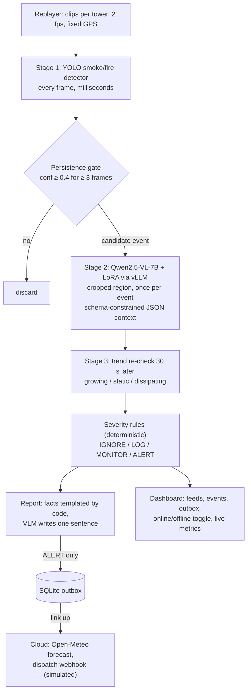

# Wildfire Edge Sentinel

Edge-first wildfire smoke detection for remote lookout towers, running on one HP ZGX Nano (NVIDIA GB10).
It detects smoke, works out what kind of fire it is (wildland, campfire, stack, fog...) and whether it is
growing, assigns a severity, and writes a dispatch-ready report locally. It contacts the cloud only for
confirmed alerts. Built for the HP Edge AI SJSU Hack.

## Problem and user

**User:** a fire lookout or ranger watching remote wildland camera towers.

**Problem:** towers sit where connectivity is weak or absent. Streaming video to a cloud model is often
impossible (no link), costly (satellite/cellular per-MB, per-token pricing at 24/7 frame rates) and slow,
yet early smoke is where minutes matter. Naive detectors also flood dispatch with false alarms from
campfires, BBQs, chimneys, industrial stacks, fog, dust and low cloud.

**Approach:** a cascade on the tower's edge box. A cheap detector runs on every frame, a local
vision-language model runs once per candidate event, and deterministic rules decide severity. Only ALERT
reports (about 1 KB plus one thumbnail) go upstream, and they wait in an outbox until the link is up.

## Architecture



One Python service (`sentinel/`) plus one local vLLM server (`zrt serve`). If the VLM times out or returns
bad JSON, the pipeline falls back to detector + trend rules with a minimum severity of MONITOR. It never
silently ignores a detection.

## The escalation rule

**The cloud is used only for data the tower cannot produce (forecast, burn schedules) and only for ALERT
events; video never leaves the device.**

| Severity | Examples | Edge action | Cloud action |
|---|---|---|---|
| IGNORE | fog, cloud, dust; known stack in its zone | count in metrics | none |
| LOG | attended campfire, BBQ/chimney, static | store locally | none |
| MONITOR | unclear source, small but new | re-check on a timer; escalate on growth | none until upgraded |
| ALERT | growing, uncontrolled, black smoke, near structures/road | queue report immediately | fetch forecast, send report + 1 thumbnail |

An ALERT raised while offline is queued at once and sent the moment the link returns, marked
"forecast pending" if the forecast cannot be fetched yet.

## Before vs after fine-tuning

Both learned stages are measured before and after fine-tuning, on the same held-out data, with the same
scripts:

| Stage | Before | After | Held-out data |
|---|---|---|---|
| Detector | YOLO-World (`yolov8s-worldv2.pt`) zero-shot, prompted with `smoke, fire` | YOLO11s fine-tuned on D-Fire | D-Fire test split |
| Context VLM | Qwen2.5-VL-7B-Instruct base | same base + LoRA distilled from a Qwen2.5-VL-32B teacher | `data/teacher/heldout.jsonl` (never trained on) |
| End-to-end | before detector + base VLM | fine-tuned detector + LoRA VLM | 20–40 labeled clips (`data/bench/clips.csv`) |

Reference rows: a SigLIP linear probe (cheap floor) and the 32B teacher itself (upper bound).

**Fairness note:** the held-out labels come from the 32B teacher, so context-VLM accuracy on them measures
distillation (agreement with the teacher), not ground truth. The optional hand-checked gold split
(`*_gold` rows) measures real accuracy.

**Results:** `python scripts/compare.py` builds all three tables into
[`results/before_after.md`](results/before_after.md) from the `results/*.json` files. Results are pending
until the Nano runs finish, and no numbers appear here that the scripts did not produce. Each script
refuses to overwrite an existing result unless given `--force`, so a BEFORE row cannot be silently
replaced.

Why these metrics: mAP50/mAP50-95 are standard for detection; source-type and group
(danger/benign/look-alike) accuracy capture whether the VLM tells a wildfire from a campfire or fog;
parse-fail rate and tokens per call show the cost of structured output; end-to-end precision and false
alarms are what a dispatcher actually sees; frames per VLM call shows how much work the cascade avoids.

## Reproduce

Everything runs on the Nano except the unit tests (`pytest`, laptop-friendly, no GPU). Run long GPU jobs in
`tmux`. The full command list, with expected outputs, is in
[`docs/plans/2026-09-22-wildfire-edge-sentinel.md`](docs/plans/2026-09-22-wildfire-edge-sentinel.md).

```bash
# 0. Setup (CUDA PyTorch for GB10 first, per the NVIDIA DGX Spark playbook)
./scripts/setup_nano.sh && source .venv/bin/activate
zrt serve hf:Qwen/Qwen2.5-VL-7B-Instruct --host 0.0.0.0 --port 8000 \
  --max-model-len 8192 --gpu-memory-utilization 0.30 --enable-prefix-caching   # tmux: vlm
# put the id from `curl -s localhost:8000/v1/models` into config/settings.json as vlm_model

# 1. Data (some steps are manual; the script prints them)
./scripts/download_data.sh

# 2. Detector: before -> train -> after
python scripts/eval_detector.py --weights yolov8s-worldv2.pt --classes smoke,fire --name before_yoloworld
python scripts/train_detector.py --epochs 40            # -> models/smoke_yolo.pt
python scripts/eval_detector.py --weights models/smoke_yolo.pt --name after_yolo11s

# 3. Context VLM: teacher labels -> before -> LoRA -> after
zrt serve hf:Qwen/Qwen2.5-VL-32B-Instruct-AWQ --host 0.0.0.0 --port 8001 \
  --max-model-len 8192 --gpu-memory-utilization 0.40                          # tmux: teacher
python scripts/teacher_label.py --model "<teacher id>" --n 2000   # -> data/teacher/{train,heldout}.jsonl
python scripts/eval_context.py --model "<base id>" --name before_base7b
python scripts/eval_context.py --model "<teacher id>" --base-url http://localhost:8001/v1 --name ref_teacher32b
python scripts/train_lora.py                            # stop the teacher first; -> adapters/context
zrt serve hf:Qwen/Qwen2.5-VL-7B-Instruct --host 0.0.0.0 --port 8000 --max-model-len 8192 \
  --gpu-memory-utilization 0.30 --enable-prefix-caching \
  --enable-lora --max-lora-rank 16 --lora-modules context=$HOME/sentinel/adapters/context
python scripts/eval_context.py --model context --name after_lora7b
python scripts/linear_probe.py

# 4. End-to-end: before -> after (stop sentinel.main first to free the GPU)
python scripts/bench.py --name before --detector-weights yolov8s-worldv2.pt --detector-classes smoke,fire --model "<base id>"
python scripts/bench.py --name after  --detector-weights models/smoke_yolo.pt --model context

# 5. Tables and cost model
python scripts/compare.py                               # -> results/before_after.md
python scripts/cost_model.py > results/cost_model.jsonl # fill config/cost_inputs.json from bench results first

# 6. Demo: dispatch stub + sentinel + dashboard on :8080
./scripts/run_all.sh
```

Optional ablations: `bench.py --detector-only` (no VLM) and `--full-frame` (no crop: token cost of
cropping). To run the live demo with the BEFORE detector, set `"detector_weights": "yolov8s-worldv2.pt",
"detector_classes": ["smoke", "fire"]` in `config/settings.json`.

## Datasets and models

Licenses below are as published by each source at the time of writing. **Verify each one before
redistributing data or weights.**

| Item | Use | License (verify) |
|---|---|---|
| [D-Fire](https://github.com/gaiasd/DFireDataset) | detector train/test (0=smoke, 1=fire) | see repository |
| [PyroNear `pyro-sdis`](https://huggingface.co/datasets/pyronear/pyro-sdis) | optional detector data/eval | see dataset card |
| [FIgLib (HPWREN)](https://www.hpwren.ucsd.edu/FIgLib/) | demo and benchmark sequences | HPWREN terms of use |
| Benign look-alikes | campfire/BBQ/stack/fog negatives | per-image open licenses |
| [Ultralytics](https://github.com/ultralytics/ultralytics) YOLO11s, YOLO-World | detector | AGPL-3.0 |
| [Qwen2.5-VL-7B-Instruct](https://huggingface.co/Qwen/Qwen2.5-VL-7B-Instruct) | student VLM | see model card |
| Qwen2.5-VL-32B-Instruct-AWQ | teacher (offline labeling only) | see model card |
| [SigLIP](https://huggingface.co/google/siglip-base-patch16-224) | linear-probe baseline | see model card |

Ultralytics is AGPL-3.0: a networked deployment of this service must offer its source, or use an
Ultralytics enterprise license.

## Limitations

- **Simulated world:** towers are replayed clips, the temperature sensor and the connectivity toggle are
  simulated, and the dispatch webhook is a local stub. The burn schedule is a local file.
- **Teacher labels are not ground truth:** the LoRA student learns to agree with the 32B teacher. Only
  the gold split measures real accuracy, and it is small.
- **Small end-to-end set:** 20–40 clips give coarse precision/recall, so treat differences of one or two
  clips as noise.
- **Single-threaded loop:** one replay thread serves every tower, and a VLM call stalls frame processing
  for all towers until it returns (bounded by the VLM timeout).

## Layout

`sentinel/` runtime (pipeline, severity, escalation, outbox, dashboard) · `scripts/` training,
evaluation, benchmark and setup · `config/` settings, towers, cost inputs · `tests/` unit tests
(`pytest`) · `docs/plans/` design and implementation plan.
