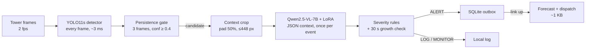
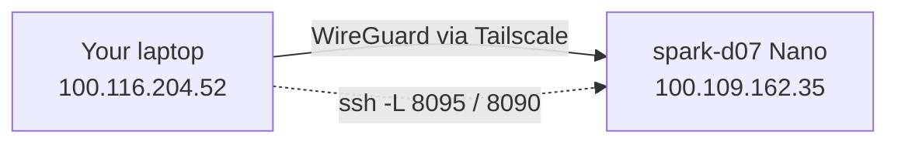
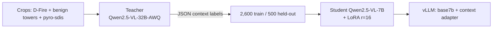

# Wildfire Edge Sentinel — Project Deep Dive

**What this is:** the complete engineering record of the project: what was built and why, how each decision was made, what went wrong and how it was fixed, and the technical detail needed to explain and defend it as its engineer.

**Status as of 2026-09-23 23:15 (Nano time, ICT):** code complete and reviewed (278 tests). Detector before/after measured. VLM LoRA training in its final epoch, BEFORE VLM evaluation running, stage-2 tower detector queued. Numbers marked *pending* are filled in as runs finish (see `docs/PROGRESS.md` and `results/`).

---

## 1. The problem and the one-paragraph answer

**User:** a fire lookout / ranger responsible for remote wildland camera towers.

**Problem:** towers sit where connectivity is weak or absent. Today's AI detection systems (e.g. ALERTCalifornia + DigitalPath, Pano AI) stream images to the cloud, where models and human analysts confirm fires. That fails exactly where it matters: no link means no detection; streaming video is expensive on cellular/satellite; and naive detectors flood dispatch with false alarms (campfires, chimneys, industrial stacks, fog, low cloud).

**Answer:** run the whole decision on the tower's edge box (an HP ZGX Nano). A small fine-tuned detector watches every frame. A local vision-language model (VLM) is consulted **once per candidate event** to understand *context* (what is burning, is it attended, is it growing, is it near homes). Deterministic rules assign a severity. Only ALERTs leave the device, as ~1 KB reports, and only when a link exists; the cloud is used solely for what the edge cannot produce (weather forecast, prescribed-burn schedules). The models are fine-tuned **on the device**, and every claim (accuracy, latency, tokens, bytes, cost) is measured before and after.

**Headline results so far**

| Measure | Before fine-tuning | After fine-tuning |
|---|---|---|
| Detector mAP50 on D-Fire test (4,306 images) | 0.002 (YOLO-World zero-shot) | **0.787** (YOLO11s) |
| Detector precision / recall | 0.10 / 0.008 | **0.78 / 0.72** |
| Detector on lookout-tower smoke (pyro-sdis val) | — | 0.213 (domain gap found) → stage-2 fine-tune *pending* |
| VLM LoRA training loss (answer tokens) | 1.21 at step 10 | **0.149** after epoch 1 (token accuracy 70% → 94.7%) |
| VLM context accuracy (500 held-out crops) | base 7B *pending* | LoRA 7B *pending* |

---

## 2. Requirements and how each was met

### 2.1 Functional requirements

| ID | Requirement | How it is achieved | Evidence |
|---|---|---|---|
| FR1 | Detect smoke/fire in tower camera frames | Fine-tuned YOLO11s on every frame (`sentinel/detector.py`) | `results/detector_after_yolo11s.json` |
| FR2 | Ignore flicker / single-frame noise | Persistence gate: ≥ 3 consecutive frames at conf ≥ 0.4 (`gate.py`) | `tests/test_gate.py` |
| FR3 | Understand context (source type, smoke colour, attended, near structures/roads, size) | Local Qwen2.5-VL-7B on a context-preserving crop, schema-constrained JSON (`vlm_client.py`, `schema.py`) | `tests/test_vlm_client.py` |
| FR4 | Distinguish emergencies from benign smoke | Deterministic severity rules IGNORE/LOG/MONITOR/ALERT (`severity.py`) | 18 rule tests |
| FR5 | Detect growth over time | Trend re-check after 30 s using the max area over a 6-frame window (`trend.py`, `pipeline.py`) | pipeline tests incl. missed-frame case |
| FR6 | Produce a dispatch-ready report | Facts templated by code, one-sentence description from the VLM (`report.py`) | `tests/test_report.py` |
| FR7 | Work offline; deliver when the link returns | Durable SQLite outbox with capped exponential backoff (`outbox.py`, `escalation.py`) | outbox + escalation tests |
| FR8 | Use the cloud only when needed | Escalation policy: only ALERTs, only forecast + dispatch (`escalation.py`) | `tests/test_escalation.py` |
| FR9 | Don't page dispatch repeatedly for one fire | Per-tower latch after ALERT until smoke clears for `cooldown_s` | `test_persistent_fire_alerts_once_until_smoke_clears` |
| FR10 | Let an operator watch and correct | Demo dashboard with online/offline toggle and false-alarm feedback (`app.py`) | `tests/test_app.py` |
| FR11 | Improve models on the device | YOLO fine-tuning, teacher labelling, LoRA distillation scripts (`scripts/`) | training logs in `results/logs/` |
| FR12 | Measure before vs after on identical data | `eval_detector.py`, `eval_context.py`, `bench.py`, `compare.py` | `results/*.json` |
| FR13 | Show usage and economics live | `sentinel.monitor` (port 8090) and the two-pane demo app (port 8095) | `results/live/live_metrics.jsonl` |

### 2.2 Non-functional requirements

| ID | Requirement | Target / design | How it is achieved | Evidence |
|---|---|---|---|---|
| NFR1 Latency | Clear cases alert fast | Gate ≈ 1.5 s + one VLM call | Immediate ALERT/IGNORE without waiting for the trend; detector ~3.3 ms/image | eval JSON `ms_per_image`; demo app timings |
| NFR2 Offline autonomy | Decide with no network | 100% of decisions local | Detector, VLM, rules all on the Nano; outbox for delivery | offline scenario tests |
| NFR3 Bandwidth | KB per alert, not video | ~1 KB report + ≤256 px thumbnail | Only ALERT payloads leave; bytes counted | `bytes_up` metric |
| NFR4 Cost | No per-token cloud bill for inference | $0 marginal API cost (hardware/power excluded) | Local vLLM; cost model with user-supplied prices | `scripts/cost_model.py`, demo econ pane |
| NFR5 Token efficiency | Minimise VLM tokens | One call per event; crop ≤448 px (256 image tokens) vs full frame (~1,196 at 1280 px) | Persistence gate, cropping, JSON cap 160 tokens, prefix caching | demo app per-image token figures |
| NFR6 Reliability | Never silently drop an emergency | VLM failure → MONITOR/ALERT fallback, never IGNORE | `fallback_severity`, exceptions caught in `_open` | pipeline tests |
| NFR7 Safety of rules | Benign labels can't hide dangerous fires | Burn schedule / benign branch never downgrade large, black-smoke, structure or vehicle fires | Review fix `c361f4b` | 4 dedicated tests |
| NFR8 Privacy / data residency | Imagery stays local | Only alert thumbnails leave | Escalation policy | design |
| NFR9 Reproducibility | Anyone can rerun it | Public repo, setup script, data scripts, pinned minimum versions | `scripts/setup_nano.sh`, README "Reproduce" | 278 tests on laptop and Nano |
| NFR10 Honesty of metrics | Fair comparisons | Same test splits; same 0.4 gate for before/after; cloud baseline at the same ≤1280 px; teacher-agreement labelled as such | eval scripts + review fixes | README methodology |
| NFR11 Operability | Survive SSH/network drops | All long jobs in `tmux`; watchers retry; fail-fast on bad sources | runbook §12 | logs |
| NFR12 Security | No secrets in a public repo | `.gitignore` for PDFs/data; grep for credentials before every push | commit hygiene | review checks |

---

## 3. Architecture



The cascade is the core idea: each stage is cheaper than the next and filters most of what it sees, so the expensive VLM runs rarely and on small inputs.

### 3.1 Components (all in `sentinel/`)

| Module | Responsibility |
|---|---|
| `schema.py` | `Detection`, `ContextResult` (pydantic; also the JSON schema sent to vLLM), `Severity` |
| `detector.py` | YOLO wrapper; lazy import; supports YOLO-World `set_classes` for the zero-shot baseline |
| `gate.py` | Persistence gate with per-tower streaks and cooldown |
| `imaging.py` | Context-preserving crops (never empty, never 0-px), JPEG encoding |
| `vlm_client.py` | OpenAI-compatible client to vLLM; `json_schema` response format; 160-token cap; one retry on bad JSON; `ensure_served` pre-flight |
| `trend.py` | growing (≥1.3×) / static / dissipating (≤0.7×) |
| `zones.py` | Per-tower benign zones (campground, stack) |
| `severity.py` | The auditable rulebook |
| `report.py` | Templated dispatch report; tolerant of partial forecasts |
| `outbox.py` | Durable queue; backoff 2, 4, 8 … capped at 300 s; thread-safe |
| `escalation.py` | The cloud-use policy |
| `cloud.py` | Open-Meteo forecast (local time zone), dispatch POST, burn schedule |
| `pipeline.py` | Orchestration: event lifecycle, windowed areas, per-fire latch, lock released during VLM calls |
| `main.py` | Runtime wiring, replay loop with per-tower isolation |
| `app.py` + `static/dashboard.html` | Operator dashboard (port 8080) |
| `live_metrics.py` + `monitor.py` | Live per-model economics from vLLM metrics (port 8090) |
| `webapp_logic.py` + `webapp.py` + `static/webapp.html` | Two-pane demo app: run models / live economics (port 8095) |

### 3.2 Event lifecycle

1. Every frame: detect; append the frame's best smoke area to a 6-frame window.
2. Gate fires → open an event; show "classifying…"; call the VLM once (dashboard lock released during the call).
3. Clear cases finalise immediately (ALERT: dangerous + near homes/black/large; IGNORE: fog/cloud).
4. Unclear cases wait 30 s and re-check growth using the window max; MONITOR repeats up to 4 times.
5. Finalise → build report → escalator decides → after an ALERT the tower is latched until smoke has been gone for 120 s.

---

## 4. The hardware and how your laptop reaches it

### 4.1 The HP ZGX Nano (GB10)

- **NVIDIA GB10 Grace Blackwell superchip:** 20-core Arm CPU + Blackwell GPU sharing **~121 GB of unified memory**. There is no separate "GPU RAM": CPU and GPU draw from one pool, so a model server, a training job and the OS all compete for the same memory.
- **OS:** DGX OS / Ubuntu 24.04, **aarch64**, system Python 3.12.
- **Consequences you must know:**
  - PyTorch must be an aarch64 CUDA build (we use `torch 2.14.0+cu130`); plain `pip install torch` may give a CPU-only wheel.
  - vLLM's `--gpu-memory-fraction` is a share of that unified pool, and it counts memory already used by *other* processes at start-up. 30% failed ("no memory for KV cache") while YOLO was training; 45% works.
  - `nvidia-smi` shows GPU utilisation but memory figures are best read from `/proc/meminfo` on this platform.

### 4.2 Networking: Tailscale + SSH



- **Tailscale** builds an encrypted WireGuard mesh ("tailnet") across the SJSU network; every device gets a stable `100.x.y.z` address. It connects **directly** (peer-to-peer, ~20 ms) when possible and falls back to a **DERP relay** (e.g. "sfo") when not. Relays add latency and can drop, which is what caused two outages (≈20:20–21:39 and a short one later).
- **SSH** with key authentication (`ssh-copy-id` once, then passwordless). User `hp11` on host `spark-d07`.
- **SSH local port forwarding** makes the Nano's web apps appear on your laptop:
  `ssh -N -L 8095:localhost:8095 -L 8090:localhost:8090 hp11@100.109.162.35` → open `http://localhost:8095`. The servers bind to `127.0.0.1` on the Nano, so they are not exposed to the network; only your tunnel reaches them.
- **Checks when something fails:** `tailscale ping 100.109.162.35` (link), then `ssh … uptime` (host), then `tmux ls` on the Nano (jobs).

### 4.3 Keeping work alive: tmux

Every long job runs in a named `tmux` session on the Nano, so an SSH drop never kills it. Current sessions: `lora`, `evalbase`, `monitor`, `snap` (dashboard snapshots), `webapp`, `tower` (queued stage-2 training). Attach with `tmux attach -t <name>`, detach with `Ctrl-b d`.

---

## 5. Edge serving: how models run on the Nano

### 5.1 HP Z Runtime (zrt) and vLLM

- **zrt** is HP's CLI wrapper around **vLLM** (a high-throughput LLM/VLM inference server with paged-attention KV caching and continuous batching).
- `zrt serve hf:<repo> --label <name> --gpu-memory-fraction <f> -- <vLLM flags>` downloads the model to `/opt/hp/zrt/models/`, starts a vLLM backend on a private **unix socket** (`/opt/hp/zrt/run/vllm-<label>.sock`), and registers it with **one** OpenAI-compatible proxy.
- **Key discovery:** all models share **one proxy port**, and you select a model by its **label** in the request (`"model": "base7b"`). There is no separate port per model (the plan's teacher-on-8001 idea was replaced). We moved the proxy from its default 8080 to **8000** so 8080 stays free for the dashboard: `zrt config set proxy.port 8000`.
- Proxy auth and TLS are disabled for local use: `zrt config set proxy.auth.type none && zrt config set proxy.tls.enabled false`.
- Flags we use: `--max-model-len=8192`, `--enable-prefix-caching` (the fixed system prompt is computed once and reused), and for LoRA `--enable-lora --max-lora-rank 16 --lora-modules context=<adapter path>` so base and adapter are served from one process.
- **Telemetry:** each backend exposes Prometheus metrics at `/metrics` on its socket (prompt/generation token counters, latency histograms, KV-cache usage). The live dashboards read these directly.

### 5.2 Structured output

The VLM must return JSON matching `ContextResult`. We send the pydantic JSON schema via `response_format={"type": "json_schema", …}`; vLLM's **guided decoding** constrains generation to valid JSON with allowed enum values. Output is capped at 160 tokens with temperature 0. Invalid JSON gets one retry; transport errors/timeouts return no result and the pipeline falls back safely.

### 5.3 Detectors

YOLO runs **in-process** on the GPU (no server): ~3.3 ms/image at 640 px. The demo app warms both detectors at start-up so the first click isn't a cold CUDA/CLIP load.

---

## 6. Edge training: how the models were improved on the Nano

### 6.1 Detector fine-tuning (YOLO11s)

- **Data:** D-Fire (21,527 images; 17,221 train / 4,306 test; YOLO labels, 0 = smoke, 1 = fire; ~half are fire-free negatives). The official source is a OneDrive link, so we used a Hugging Face mirror (`badsaarow/d-fire`) after verifying its split counts match the published dataset exactly, and unpacked it with `scripts/prepare_dfire.py`.
- **Run:** `yolo11s.pt` (COCO-pretrained) → 50 epochs, 640 px, batch 32, ~2.75 min/epoch while sharing the GPU. A 1-epoch timing run came first (already mAP50 0.085) to choose the epoch count.
- **Why it works:** full fine-tuning of a 9M-parameter detector is cheap, and transfer from COCO features converges fast (mAP50 0.52 by epoch 5, 0.787 final).
- **Stage 2 (pending):** the tower-domain check (§8.4) showed mAP50 0.213 on lookout-tower smoke. We continue training from the stage-1 weights on pyro-sdis (29,537 tower images) at **960 px** so small distant plumes keep enough pixels, saving to `models/tower_yolo.pt` so stage 1 stays intact.

### 6.2 Teacher → student distillation for the VLM



- **Why distill:** no labelled dataset exists for "what kind of smoke is this, is it attended, is it near homes". A larger local model (32B) produces those labels on the device, with no data leaving it. A 7B student then learns to reproduce them at a fraction of the latency and memory, which is what the tower can afford at runtime.
- **Teacher labelling:** 3,100 crops (2,000 D-Fire, 300 benign tower images, 800 pyro-sdis tower smoke) at ~0.8 s/crop with 32 concurrent requests (vLLM batches them). A 500-crop trial first checked quality: on D-Fire crops that truly contain smoke/fire the teacher said "fog/cloud" only 6.6% of the time.
- **Label mix (train):** fog/dust/cloud 915, unknown 579, wildland 477, industrial stack 328, controlled burn 284, vehicle 10, structure 5, campfire 2. Weakness: almost no campfire/BBQ examples in the available data.
- **LoRA configuration and why:**

| Setting | Value | Reason |
|---|---|---|
| Rank / alpha / dropout | 16 / 32 / 0.05 | Small adapter (a few M params), standard alpha = 2×rank |
| Target modules | `q_proj, k_proj, v_proj, o_proj` of the **language model only** | The vision tower names its layers `qkv`/`proj`, so it stays frozen; we teach reasoning/format, not new visual features |
| Loss | **Completion-only** (answer JSON tokens) | Initially the prompt + ~250 image tokens were in the loss (answer <15% of it); switching to prompt/completion format fixed it (180 → 55 supervised tokens per example) |
| Epochs / LR / batch | 2 / 1e-4 / 4 × grad-accum 4 (effective 16) | 2,600 examples → 163 optimiser steps per epoch, 326 total |
| Image budget | `max_pixels = 448²` | Same as runtime crops, so train and serve see identical token counts |
| Precision | bf16 + gradient checkpointing | Fits alongside a served vLLM model in unified memory |
| Prompt | Imported from `sentinel.vlm_client` | Training prompt is byte-identical to the runtime prompt |

- **Training so far:** loss 1.21 → 0.149 and answer-token accuracy 70% → 94.7% by the end of epoch 1.

### 6.3 Baselines used for honesty

- **YOLO-World zero-shot** as the detector BEFORE (a standard YOLO has no smoke class, so it couldn't be a baseline at all).
- **Base Qwen2.5-VL-7B** with the identical prompt/schema as the VLM BEFORE.
- **SigLIP linear probe** (image embeddings + logistic regression) as a cheap classifier to show whether the VLM earns its cost.
- **32B teacher** as an upper-bound reference (deferred: ~1 h for 500 crops at 7.5 s/call).

---

## 7. Why these models

| Choice | Why | Alternatives considered |
|---|---|---|
| **YOLO11s** detector | Fast (~3 ms), small enough to fully fine-tune in hours, strong transfer from COCO, mature tooling | RT-DETR (Apache licence, slower); larger YOLOs (slower, little gain for 2 classes). Note: Ultralytics is AGPL-3.0 |
| **YOLO-World** baseline | Detects from text prompts with no training → an honest "off-the-shelf" before | COCO YOLO (no smoke class) |
| **Qwen2.5-VL-7B** student | Proven in HP's own ZGX example (Med VLM), first-class vLLM support incl. LoRA and guided JSON, fits comfortably, good visual grounding | Qwen3-VL-8B (newer, less proven on this stack), Gemma 3 |
| **Qwen2.5-VL-32B-AWQ** teacher | 4-bit AWQ fits in ~21 GB, fast enough to label thousands of crops overnight | 72B-AWQ (43 GB, ~2× slower) |
| **SigLIP** probe | Minutes to train; a credible ablation reviewers expect | CLIP |
| **vLLM via zrt** | HP's supported path on the Nano; batching, prefix caching, LoRA serving, metrics | Raw transformers inference (slow, no batching) |

---

## 8. Techniques that improve performance (and the reasoning)

### 8.1 Efficiency (tokens, latency, cost)
1. **Cascade:** a 3 ms detector gates a multi-second VLM, so the VLM runs on events, not frames.
2. **Persistence gate:** 3 consecutive frames removes flicker before any VLM call.
3. **One VLM call per event**, plus a growth re-check that uses cheap detector areas, not more VLM calls.
4. **Context crops:** 448 px max → 256 image tokens vs ~1,196 for a 1280 px full frame, with 50% padding so fire rings, people and houses stay in view.
5. **Guided JSON + 160-token cap + temperature 0:** short, parseable, deterministic answers.
6. **Prefix caching:** the fixed system prompt's KV cache is reused across calls.
7. **Templated report:** facts (GPS, time, confidence) come from code; the VLM writes one sentence.
8. **Distillation:** 32B-quality labels served by a 7B model.

### 8.2 Accuracy and safety
1. **Domain fine-tuning** of the detector (0.002 → 0.787 mAP50 on D-Fire), then **stage-2 tower fine-tuning** for the target camera type.
2. **Completion-only LoRA loss** so the adapter learns the answer, not the prompt.
3. **Windowed growth (max over 6 frames):** one missed detection can't fake growth or hide it.
4. **Per-fire latch:** one ALERT per fire, not one every 2 minutes.
5. **Severity floors:** large, black-smoke, structure and vehicle fires can never be downgraded by a "benign" label or a scheduled burn.
6. **Safe fallback:** a VLM failure yields MONITOR/ALERT, never IGNORE.

### 8.3 Measurement discipline
- Same held-out test data before and after; the same 0.4 gate for both detectors in the end-to-end bench.
- The VLM "accuracy" against teacher labels is **distillation agreement**, labelled as such; a hand-checked gold split measures real accuracy.
- Cloud baseline uses the **same ≤1280 px frame** the edge would use; the edge is labelled "$0 marginal API cost (hardware and power not included)".
- Every run's JSON, logs and plots are committed to `results/`, one commit per step, in execution order.

### 8.4 How the tower gap was found
Running a FIgLib tower frame (21 minutes after ignition) through the demo showed **no detections** from either detector. Rather than guess, we measured: the fine-tuned detector scores **mAP50 0.213** on 4,099 lookout-tower images vs 0.787 on D-Fire. D-Fire is mostly close-range scenes; tower smoke is small and distant in 2048×1536 frames. The fix (stage-2 training at higher resolution on tower data) follows directly from the measurement, and the before/after on tower data becomes another reported result.

---

## 9. Step-by-step implementation (what happened, in order)

**Day 0 (Tue 9/22) — planning and core code**
1. Read the hackathon brief; chose the fire-lookout user and an escalation-first design (the brief scores "an explicit, defensible, measurable decision about when to escalate to the cloud").
2. Wrote the design doc and a 28-task TDD implementation plan; researched existing systems for a comparative study (costs, latency, false alarms).
3. Built the pipeline on the laptop with fake models, batch by batch; each batch went through an implementer, a spec review and a code-quality review.

**Day 1 (Wed 9/23) — the Nano**
4. Connected over Tailscale + SSH; found a stuck root process holding 87 GB (stopped with sudo → 114 GB free).
5. Installed CUDA PyTorch for aarch64; fixed a Python 3.12 incompatibility; 148 → 278 tests pass on the device.
6. Configured zrt (proxy on 8000); served base 7B; smoke-tested chat and schema-constrained JSON.
7. Data: D-Fire (HF mirror, verified), pyro-sdis (unpacked, class id remapped), 300 benign tower images, 5 FIgLib ignition sequences.
8. Detector BEFORE eval → 50-epoch fine-tune → AFTER eval (0.002 → 0.787).
9. Served the 32B teacher; labelled 3,100 crops.
10. Built and reviewed the live metrics dashboard (port 8090) and the two-pane demo app (port 8095).
11. Swapped teacher → base 7B; started the BEFORE VLM eval and LoRA training in parallel.
12. Found and measured the tower-domain gap; queued stage-2 tower fine-tuning.

**Next:** serve the LoRA adapter → AFTER VLM eval → tower detector eval → end-to-end bench before/after → comparison table → demo rehearsal and video.

---

## 10. Challenges, constraints and solutions

| # | Challenge | Root cause | Solution | Lesson |
|---|---|---|---|---|
| 1 | Only 25 GB free on a 121 GB machine | A leftover root `trtllm-serve` held 87 GB but wasn't serving | Identified owner/command; you stopped it with sudo | Inspect before assuming; never kill others' processes without consent |
| 2 | Tests crashed on the Nano | `threading.Lock \| None` annotation works on 3.13, fails on 3.12 (Lock is a function there) | Quoted the annotation | Test on the target runtime, not just the laptop |
| 3 | No PyTorch on the system | DGX OS ships without it in system Python | venv + CUDA 13 aarch64 wheels; guard in setup script | Verify `torch.cuda.is_available()` before anything else |
| 4 | zrt used port 8080 (dashboard's port) and one proxy for all models | zrt architecture | Proxy on 8000; select models by label | Read the tool's model of the world before planning ports |
| 5 | vLLM failed "no memory for KV cache" | Unified memory: fraction counts other processes | 45% fraction | Plan memory as one pool on GB10 |
| 6 | D-Fire only on OneDrive | Hosting | Verified HF mirror (exact split counts) + converter | Validate mirrors against published counts |
| 7 | `hf download` started 14,628 extra files | Mirror contained raw files too | `--include "data/*"` | Scope downloads |
| 8 | pyro-sdis smoke labelled class 1 | Dataset convention | Remap 1→0 with a guarded converter | Check class ids before training |
| 9 | Teacher reference eval ~1 h | 32B at ~7.5 s/call, sequential | Deferred as optional; prioritised base/LoRA rows | Cut optional work under a deadline |
| 10 | LoRA was learning the prompt | Messages-format loss covered prompt + image tokens | Prompt/completion format → completion-only loss | Inspect which tokens are supervised |
| 11 | Tailscale dropped twice | Relay path instability | tmux for every job; watchers that retry | Design for flaky links (the product's own premise) |
| 12 | Nano code stale after history rewrite | `git reset --mixed` doesn't touch files | Back up local files, `reset --hard`, restore | Know what each reset mode changes |
| 13 | Pushes failed "publickey" | Empty ssh-agent fell back to an unregistered key | Repo-local `core.sshCommand` with the working key | Diagnose with `ssh -T` per key |
| 14 | zsh mangled `$sha:refs/...` | `:r` is a zsh modifier | `${sha}:refs/...` | Brace variables in refspecs |
| 15 | Detector misses tower smoke | Domain gap (close-range training data) | Measured it; stage-2 tower fine-tune at 960 px | Test on the deployment domain |
| 16 | Review-caught logic bugs | — | Scheduled burn hid house fires; one missed frame faked growth; one fire re-alerted every 2 min; dashboard froze during VLM calls; outbox backoff overflowed after 62 retries; replayer hung on bad paths; totals doubled under a race; cloud baseline was unfairly large | Two-stage review after every batch pays for itself |
| 17 | LoRA model returned 404 through the proxy | zrt's proxy routes only the served label (`base7b`), even though `/v1/models` lists the adapter | Call the backend's own unix socket (`unix:///opt/hp/zrt/run/vllm-base7b.sock`); added socket support to the VLM client and demo app | Verify a served model with a real request, not just a listing |

---

## 11. How scope and improvisation were decided

1. **Start from the scoring criteria.** The brief rewards an explicit, measurable escalation decision, a named user, and conditions the cloud can't handle, so the escalation rule and offline behaviour were built first and never cut.
2. **Pick the user whose constraint is real.** A remote tower genuinely lacks connectivity, which makes "edge-first" a necessity rather than a preference.
3. **Measure before claiming.** Every improvement has a before and an after on the same data; when a demo looked wrong (no tower detections), we measured before acting.
4. **Cut lines decided in advance** (linear probe → feedback button → LoRA → ablations), never the escalation policy, outbox, benchmarks or cost model.
5. **Let reviews and data redirect the work:** the tower gap, the loss-masking fix and the fairness fixes in the economics all came from evidence, not the original plan.
6. **Protect the timeline:** long GPU jobs start first and overlap (teacher labelling during detector training; LoRA during the BEFORE eval), while laptop work proceeds against fakes.

---

## 12. Operations runbook

**Ports on the Nano (all bound to 127.0.0.1 unless noted)**

| Port | Service | How to start |
|---|---|---|
| 8000 | zrt proxy → vLLM models (`base7b`, `context`, `teacher32b`) | `zrt serve …` |
| 8080 | Operator dashboard + replay loop | `./scripts/run_all.sh` |
| 8090 | Live model economics | `python -m sentinel.monitor --port 8090` |
| 8095 | Two-pane demo app | `python -m sentinel.webapp --port 8095` |
| 9000 | Dispatch stub (simulated cloud) | started by `run_all.sh` |

**Common commands**

```bash
# from the laptop
ssh -N -L 8095:localhost:8095 -L 8090:localhost:8090 hp11@100.109.162.35
tailscale ping 100.109.162.35

# on the Nano
tmux ls                         # running jobs
zrt status                      # served models + memory
curl -s localhost:8000/v1/models
zrt service stop base7b         # free a model's memory
./scripts/collect_artifacts.sh  # gather plots/logs into results/
```

**Where things live:** code `~/sentinel`; datasets `data/`; detector weights `models/`; LoRA adapter `adapters/context/`; run outputs `runs/`; results for the report `results/`; logs `*.log`; zrt models `/opt/hp/zrt/models/`; zrt sockets and logs `/opt/hp/zrt/run/`.

---

## 13. The economics model

- **Edge:** detector on every frame; VLM only on candidates; tokens are local, so marginal API cost is $0 (hardware and power excluded); uplink cost = bytes of ALERT payloads × $/GB.
- **Cloud baseline ("every frame to a cloud VLM"):** frames × (full-frame image tokens at ≤1280 px + prompt overhead) × $/M input tokens + output tokens × $/M output tokens + image upload bytes × $/GB.
- **Offline:** a cloud-only system processes nothing; the edge keeps deciding and queues alerts.
- **Prices are inputs** (from current published rates, cited when used); nothing is hard-coded.
- Qwen2.5-VL image tokens: resize to multiples of 28 within pixel limits, tokens = (H/28)·(W/28). A 448×448 crop = 256 tokens; a 1920×1080 frame at ≤1280 px = 1,196 tokens (2,691 at native size).

---

## 14. Questions you should be ready for

**Why not just send everything to the cloud?** Towers often have no link; streaming is expensive; latency matters; imagery near homes raises privacy concerns. Our design decides locally and sends ~1 KB only for alerts.

**What exactly is your escalation rule?** Only ALERT events leave the device, and the cloud is contacted only for data the edge can't produce (forecast, burn schedules) plus delivery to dispatch. Video never leaves.

**How do you know the VLM adds value over the detector?** The end-to-end bench compares detector-only vs the full cascade on the same clips (false alarms, precision/recall), and the SigLIP probe shows what a cheap classifier achieves.

**Isn't teacher-label accuracy circular?** Yes, it measures distillation agreement, and we label it that way. Real accuracy comes from the hand-checked gold split and the end-to-end bench on labelled clips.

**Why LoRA and not full fine-tuning?** A few million trainable parameters fit alongside a served model in unified memory, train in about 1.5 hours, and are served next to the base model from one vLLM process, so before and after can be compared live.

**Why is the zero-shot baseline so low?** YOLO-World isn't trained for amorphous smoke; it's the honest off-the-shelf option, since a standard YOLO has no smoke class. mAP from `eval_detector` doesn't depend on the confidence gate.

**What happens if the VLM is down?** Detections fall back to MONITOR (ALERT if growing); nothing is silently ignored.

**What's your biggest limitation?** Tower-domain generalisation (being addressed by stage 2), few campfire/BBQ examples, simulated connectivity and sensors, and teacher labels that aren't ground truth.

---

## 15. Limitations and next steps

- **Data:** few attended-fire examples; teacher labels ≠ ground truth; held-out crops are hash-split from D-Fire train crops (near-duplicate frames can inflate agreement).
- **Power:** the ZGX Nano needs mains-class power; a solar tower would run the distilled student on a smaller edge device, with the Nano as a training hub.
- **Scale:** simulated feeds, not a production camera network; single-threaded replay loop.
- **Next:** stage-2 tower detector results; LoRA AFTER eval; end-to-end bench; gold split; campfire/BBQ data; multi-camera fusion; field trial.

---

## 16. Glossary

| Term | Meaning |
|---|---|
| mAP50 / mAP50-95 | Mean average precision at IoU 0.5 / averaged over IoU 0.5–0.95 |
| Precision / recall | Share of detections that are right / share of real objects found |
| VLM | Vision-language model: takes an image and text, returns text |
| LoRA | Low-rank adapters: small trainable matrices added to frozen weights |
| Distillation | Training a smaller "student" to reproduce a larger "teacher" |
| Guided decoding | Constraining generation to a grammar/schema (here JSON) |
| KV cache / prefix caching | Stored attention keys/values; reusing them for a shared prompt prefix |
| AWQ | Activation-aware 4-bit weight quantisation |
| Unified memory | One memory pool shared by CPU and GPU (GB10) |
| Tailscale / DERP | WireGuard mesh VPN / its relay servers when direct paths fail |
| tmux | Terminal multiplexer that keeps jobs running after disconnects |
| Cascade | Cheap model filters inputs for an expensive one |
